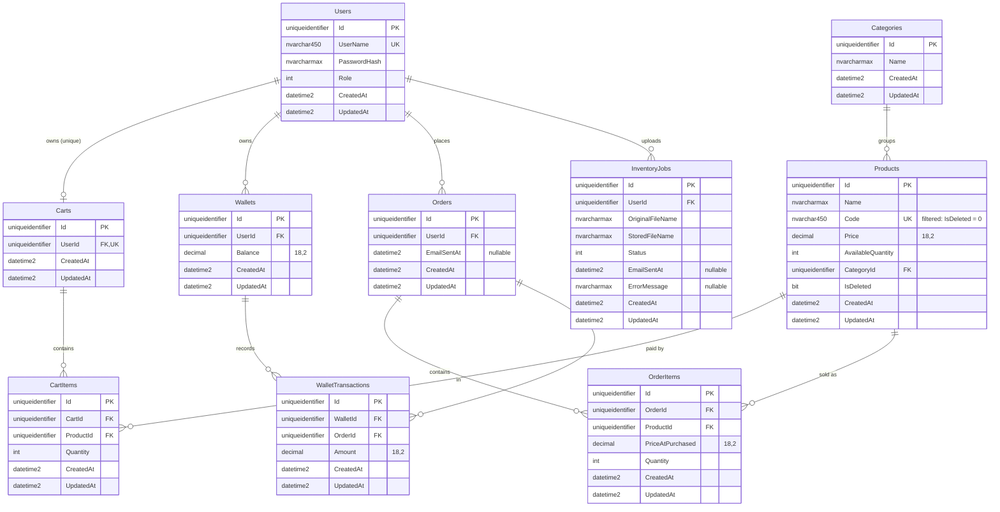

# Database design

_Current schema as of 2026-09-23, branch `main`._

**Sources:** `ecommerce.Domain/Entities/*.cs`, `ecommerce.Infrastructure/Persistence/AppDbContext.cs`, `ecommerce.Infrastructure/Migrations/ApplicationDbContextModelSnapshot.cs`

- **Engine:** SQL Server 2022 (`docker-compose.yml`, container `sql-dev`)
- **ORM:** EF Core 10.0.12, code-first
- **Migrations applied, in order:**
  1. `20260920085834_InitialCreate`
  2. `20260921025839_AddIsDeletedToProduct`
  3. `20260921032705_Cleanup`

## Overview

The database has 10 tables:

| Group | Tables |
|---|---|
| Identity | `Users` |
| Catalogue | `Categories`, `Products` |
| Shopping | `Carts`, `CartItems` |
| Sales | `Orders`, `OrderItems` |
| Money | `Wallets`, `WalletTransactions` |
| Operations | `InventoryJobs` |

## Entity relationship diagram

## Common columns

Every entity inherits from `CommonEntity`, so every table has these 3 columns:

| Column | Type | Set by |
|---|---|---|
| `Id` | `uniqueidentifier`, PK | `ApplyTimeStamp()` in `SaveChanges`: `Guid.CreateVersion7()` on insert |
| `CreatedAt` | `datetime2` | `ApplyTimeStamp()`: `DateTime.UtcNow` on insert |
| `UpdatedAt` | `datetime2` | `ApplyTimeStamp()`: `DateTime.UtcNow` on insert and update |

The application sets these values; the database has no defaults for them. The per-table sections below leave these 3 columns out.

## Tables

Every column is `NOT NULL` unless the table marks it as nullable.

### Users

| Column | Type | Constraint |
|---|---|---|
| `UserName` | nvarchar(450) | Unique index `IX_Users_UserName` |
| `PasswordHash` | nvarchar(max) | |
| `Role` | int | `RoleEnum`: 0 = Admin, 1 = Customer |

### Categories

| Column | Type | Constraint |
|---|---|---|
| `Name` | nvarchar(max) | |

### Products

| Column | Type | Constraint |
|---|---|---|
| `Name` | nvarchar(max) | |
| `Code` | nvarchar(450) | Unique index `IX_Products_Code`, filter `[IsDeleted] = 0` |
| `Price` | decimal(18,2) | |
| `AvailableQuantity` | int | |
| `CategoryId` | uniqueidentifier | FK → `Categories.Id`, cascade, indexed |
| `IsDeleted` | bit | Soft-delete flag |

- **Soft delete:** EF applies the global query filter `HasQueryFilter(p => !p.IsDeleted)`, so normal queries never return deleted products.
- **Code reuse:** the unique index only covers rows where `IsDeleted = 0`, so a new product can reuse a deleted product's `Code`.

### Carts

| Column | Type | Constraint |
|---|---|---|
| `UserId` | uniqueidentifier | FK → `Users.Id`, cascade, **unique** index |

A user has at most one cart.

### CartItems

| Column | Type | Constraint |
|---|---|---|
| `CartId` | uniqueidentifier | FK → `Carts.Id`, cascade, indexed |
| `ProductId` | uniqueidentifier | FK → `Products.Id`, cascade, indexed |
| `Quantity` | int | |

There is no price column. The cart's price is read from `Products.Price` each time.

### Orders

| Column | Type | Constraint |
|---|---|---|
| `UserId` | uniqueidentifier | FK → `Users.Id`, cascade, indexed |
| `EmailSentAt` | datetime2 | Nullable |

There is no total column. The order total is the sum of `OrderItems.PriceAtPurchased × Quantity`.

### OrderItems

| Column | Type | Constraint |
|---|---|---|
| `OrderId` | uniqueidentifier | FK → `Orders.Id`, cascade, indexed |
| `ProductId` | uniqueidentifier | FK → `Products.Id`, cascade, indexed |
| `PriceAtPurchased` | decimal(18,2) | Price copied from `Products.Price` at checkout |
| `Quantity` | int | |

### Wallets

| Column | Type | Constraint |
|---|---|---|
| `UserId` | uniqueidentifier | FK → `Users.Id`, cascade, indexed (**not** unique) |
| `Balance` | decimal(18,2) | |

`WalletEntity` sets `Balance = 1000` when a new wallet object is created in C#. The database column itself has no default.

### WalletTransactions

| Column | Type | Constraint |
|---|---|---|
| `WalletId` | uniqueidentifier | FK → `Wallets.Id`, cascade, indexed |
| `OrderId` | uniqueidentifier | FK → `Orders.Id`, **restrict**, indexed |
| `Amount` | decimal(18,2) | Checkout writes a negative value (a debit) |

### InventoryJobs

| Column | Type | Constraint |
|---|---|---|
| `UserId` | uniqueidentifier | FK → `Users.Id`, cascade, indexed |
| `OriginalFileName` | nvarchar(max) | |
| `StoredFileName` | nvarchar(max) | |
| `Status` | int | `InventoryJobStatusEnum`: 0 Stored, 1 Accepted, 2 Processing, 3 Done, 4 Failed |
| `EmailSentAt` | datetime2 | Nullable |
| `ErrorMessage` | nvarchar(max) | Nullable |

## Indexes

| Table | Index | Columns | Unique | Filter |
|---|---|---|---|---|
| Users | `IX_Users_UserName` | UserName | ✔ | |
| Products | `IX_Products_Code` | Code | ✔ | `[IsDeleted] = 0` |
| Products | `IX_Products_CategoryId` | CategoryId | | |
| Carts | `IX_Carts_UserId` | UserId | ✔ | |
| CartItems | `IX_CartItems_CartId` | CartId | | |
| CartItems | `IX_CartItems_ProductId` | ProductId | | |
| Orders | `IX_Orders_UserId` | UserId | | |
| OrderItems | `IX_OrderItems_OrderId` | OrderId | | |
| OrderItems | `IX_OrderItems_ProductId` | ProductId | | |
| Wallets | `IX_Wallets_UserId` | UserId | | |
| WalletTransactions | `IX_WalletTransactions_OrderId` | OrderId | | |
| WalletTransactions | `IX_WalletTransactions_WalletId` | WalletId | | |
| InventoryJobs | `IX_InventoryJobs_UserId` | UserId | | |

Every table also has a clustered primary key on `Id`.

## Foreign keys and delete behaviour

| Child | Column | Parent | On delete |
|---|---|---|---|
| Carts | UserId | Users | Cascade |
| CartItems | CartId | Carts | Cascade |
| CartItems | ProductId | Products | Cascade |
| Products | CategoryId | Categories | Cascade |
| Orders | UserId | Users | Cascade |
| OrderItems | OrderId | Orders | Cascade |
| OrderItems | ProductId | Products | Cascade |
| Wallets | UserId | Users | Cascade |
| WalletTransactions | WalletId | Wallets | Cascade |
| WalletTransactions | OrderId | Orders | **Restrict** |
| InventoryJobs | UserId | Users | Cascade |

**Why `WalletTransactions.OrderId` is restrict:** without it, deleting a user would reach `WalletTransactions` by two cascade paths (Users → Wallets → WalletTransactions and Users → Orders → WalletTransactions). SQL Server rejects a schema with multiple cascade paths, so `OnModelCreating` sets this one FK to `DeleteBehavior.Restrict`.

Every relationship is one-way in EF: `WithMany()` has no collection navigation on the parent. For example, `OrderEntity` has no `Items` property; code loads order items by querying `OrderItems` for the `OrderId`.

## Design rules this schema enforces

| Rule | How the schema does it |
|---|---|
| A past order's price never changes | `OrderItems.PriceAtPurchased` is a copy of the product price made at checkout |
| A cart always shows the current price | `CartItems` has no price column; the price comes from `Products` |
| Every wallet charge points to one order | `WalletTransactions` stores `WalletId`, `OrderId` and `Amount` |
| One cart per user | Unique index on `Carts.UserId` |
| Product codes are unique among live products | Filtered unique index on `Products.Code` |
