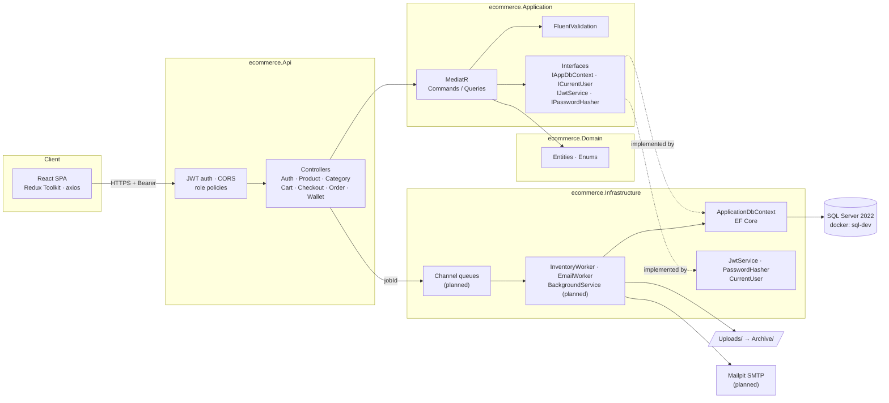
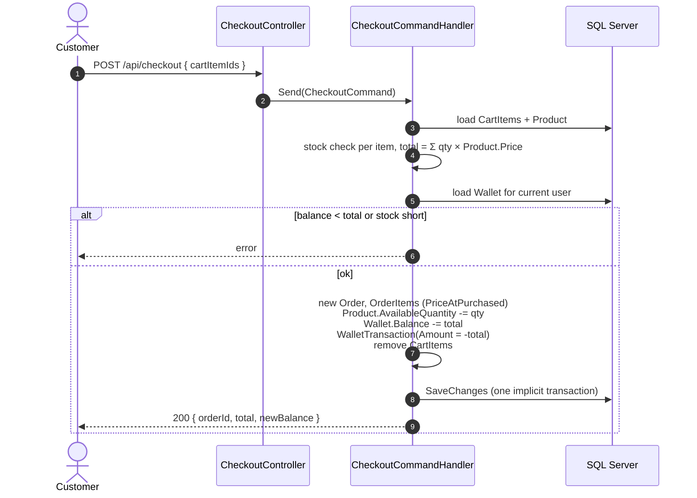
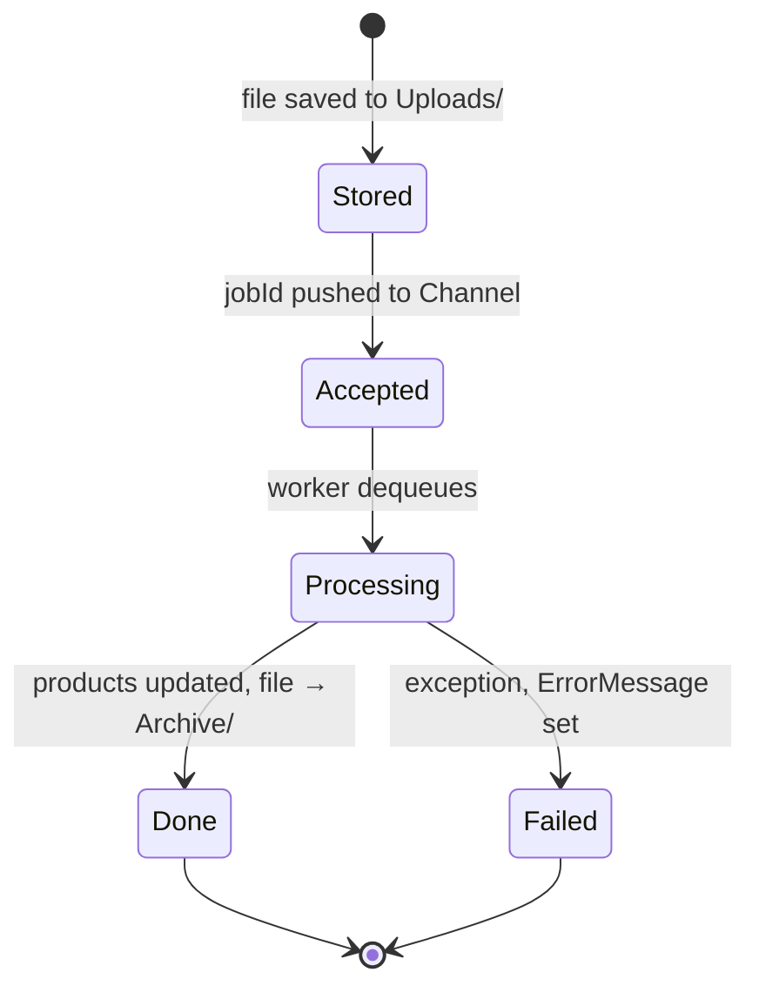

# E-Commerce: system architecture

_As of 2026-09-23, branch `main`._

A wallet-paid shop: customers browse, cart and check out against a prepaid balance; admins manage the catalogue and bulk-update stock by file upload. This doc maps the code as it stands, plus the planned pieces from `plan/08–14`.

**Stack:** .NET 10 · ASP.NET Core · MediatR CQRS · EF Core → SQL Server 2022 · JWT bearer · `Channel<T>` + `BackgroundService` · React + Redux Toolkit (planned)

- [Architecture](#architecture)
- [API surface](#api-surface)
- [Key flows](#key-flows)
- [Database](database-design.md)
- [Gaps found](#gaps-found-in-the-current-code)

## Architecture

Clean Architecture, four projects. Dependencies point inward; `Application` declares interfaces, `Infrastructure` implements them.

### Layer rules

| Layer | Holds |
|---|---|
| Domain | Entities, enums, pure rules. No EF, no MediatR. |
| Application | One folder per feature, `Commands/` + `Queries/`, handler + validator + DTO. |
| Infrastructure | EF Core, JWT, file storage, SMTP. |
| Api | Thin controllers that `ISender.Send` and return. |

### Cross-cutting

- IDs: `Guid.CreateVersion7()` set in `SaveChanges` (time-ordered, index-friendly).
- `CreatedAt` / `UpdatedAt` stamped in UTC by the DbContext.
- Products soft-deleted via global query filter `!IsDeleted`.
- Background work moves ids through `Channel<Guid>`, one DI scope per job.

## API surface

All routes under `/api/{controller}`.

| Area | Endpoints | Access |
|---|---|---|
| Auth | `POST login` · `POST register` · `POST logout` · `GET me` | public / user |
| Category | `GET` · `GET {id}` | public |
| | `POST` · `PUT {id}` · `DELETE {id}` | admin |
| Product | `GET` (paged) · `GET {id}` | public |
| | `POST` · `PUT {id}` · `PATCH {id}/price` · `DELETE {id}` | admin |
| Cart | `GET mycart` · `POST add` · `PATCH update/{itemId}` · `DELETE remove/{itemId}` · `DELETE clear` | customer |
| Checkout | `POST` | customer |
| Order | `GET` (summary list) · `GET {id}` | customer |
| Wallet | `GET balance` · `GET transactions` | customer |
| Inventory _(planned)_ | `POST upload` → 202 + jobId · `GET` job status | admin |

## Key flows

Checkout is the only flow that moves money; inventory upload is the only one that runs outside the request.

### Checkout

### Inventory job lifecycle

- States map 1:1 to `InventoryJobStatusEnum`.
- The request returns `202` once the job is `Accepted`.
- Worker uses `IServiceScopeFactory`, one scope per job; try/catch per job, not around the loop.
- Queue is in-memory: jobs still `Accepted` at restart are lost. Re-enqueue them at startup by querying that status.
- `EmailSentAt` on both Orders and InventoryJobs records whether the notification went out.

## Database

See [database-design.md](database-design.md) for the schema, database diagram, indexes and delete rules.
